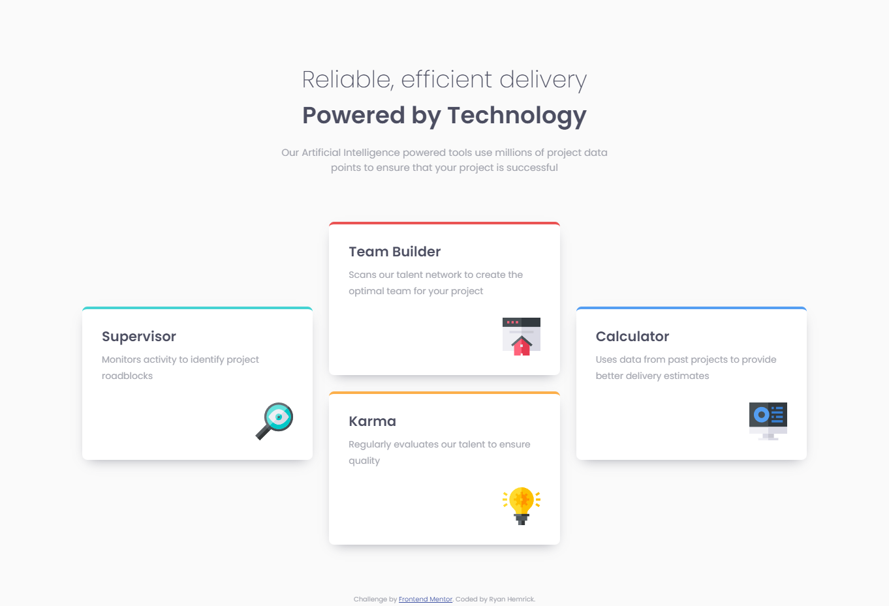

# Frontend Mentor - Four card feature section solution
This is a solution to the [Four card feature section challenge on Frontend Mentor](https://www.frontendmentor.io/challenges/four-card-feature-section-weK1eFYK). Frontend Mentor challenges help you improve your coding skills by building realistic projects. 

## Table of contents

- [Overview](#overview)
  - [The challenge](#the-challenge)
  - [Screenshot](#screenshot)
  - [Links](#links)
- [My process](#my-process)
  - [Built with](#built-with)
  - [What I learned](#what-i-learned)
- [Author](#author)

## Overview
- A responsive 'card feature' page built with HTML & CSS (Grid)

### The challenge
- Build out this 'four-card feature' section and get it looking as close to the design as possible

### Screenshot

### Links
- Live Site URL: https://clever-gnome-9ac458.netlify.app

## My process
- Utilized *CSS Grid* on the **body** element to horizontally and vertically center the grid items (header, main)
- Used a *container* class to set the max-width of the grid items for larger screen sizes
- Utilized *CSS Grid* properties to dynamically adjust the layout on larger screen sizes
- Used a mobile-first approach to writing CSS
 

### Built with
- Semantic HTML5 markup
- CSS custom properties
- CSS Grid
- Mobile-first approach to CSS

### What I learned
- Continued practice with CSS Grid properties and adjusting CSS Grid layouts on different screen sizes
- Continued practice with writing mobile-first CSS
- Continued practice with utilizing responsive units for spacing and media queries

## Author
- Ryan Hemrick